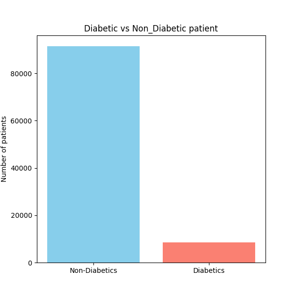
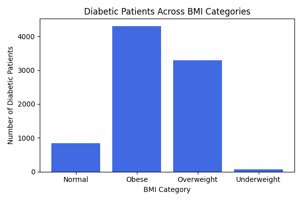

# Diabetes Data Analysis Using PostgreSQL
*Portfolio Project by Ambali Ayishat*

---

## 1.  Introduction
This project explores a comprehensive diabetes dataset containing patient demographic and clinical information.
Using SQL and PostgreSQL, the goal is to uncover patterns, trends, and potential risk indicators associated with diabetes.  
By querying the dataset, we uncover how factors such as gender, BMI, age, hypertension, and heart_disease relate to diabetes prevalence.
- **SQL Queries:** Check them out here → [SQL Scripts](Sql_project/)

---

## 2. Dataset description
This dataset includes patient health records across different continent with the following attributes:
- year
- gender
- age
- location
- race:AfricanAmerican,race:Asian,race:Caucasian,race:Hispanic,race:Other
- hypertension
- heart_disease
- smoking_history
- bmi
- hbA1c_level
- blood_glucose_level
- diabetes
---

## 3. Objectives
The analysis aims to answer the following questions:
1. How many patients are diabetic vs non-diabetic?
2. What is the average BMI by diabetes status?
3. What is the diabetes prevalence by gender?
4. How many diabetic patients also have hypertension or heart_disease?
5. Which age group has the highest average blood glucose?
6. Which locations have the most diabetic patients?
7. What is the relationship between BMI categories and diabetes status?
---

## 4. Tools Used
To uncover trends in major life-threatening diseases,
I harnessed the power of several key tools:
- **SQL:** The backbone of my analysis, enabling me to query the database and extract critical insights.
- **PostgreSQL:** My preferred database management system, ideal for handling and organizing complex datasets.
- **Visual Studio Code:** My go-to environment for database management and executing SQL queries efficiently.
- **Python:** Pandas, Matplotlib, Seaborn
- **GitHub:** Essential for version control and sharing my SQL scripts and analysis, ensuring collaboration, transparency, and project tracking.
- **Excel/CSV:** Used for editing and cleaning of the dataset, helping to structure the data properly before deeper analysis.

---
## 6. Project Structure
Sql-Analytics-Project/
│  

├── Charts/                → All visualizations generated from SQL and Python  

├── Sql_project/          → SQL query scripts  

├── Codes                 → Python scripts or Jupyter notebooks for data processing & visualization           

├── diabetes_dataset.csv  → Dataset used for analysis  

└── README.md             → Project documentation
---

## 5. SQL Analysis & Insights

### ✅ 1. How many patients are diabetic vs non-diabetic?
Group patients by diabetes status and count.  
This gives an overview of the dataset distribution.
```sql
SELECT 
    CASE WHEN DIABETICS = 1 THEN 'Diabetics' else 'Non_Diabetics'
    END AS Diabetics_status,
COUNT(*) as Num_Patients
from DIABETICS_db
GROUP by Diabetics
ORDER by Num_Patients DESC;
```


### ✅ 2. Average BMI by Diabetes Status  
**Approach:**  
Use `AVG()` and group by diabetes flag to compare BMI between groups.  
This helps identify whether diabetics tend to have higher BMI.
```sql
SELECT
    CASE WHEN DIABETICS = 1 THEN 'Diabetic' ELSE 'Non_Diabetic' END AS Diabetes_Status,
   ROUND(AVG(BMI),2) AS AVG_BMI
FROM DIABETICS_db
GROUP BY DIABETICS
ORDER BY AVG_BMI
```


### ✅ 3. Diabetes Prevalence by Gender  
**Approach:**  
Filter diabetics only, then count by gender.  
I also calculated percentage prevalence to give a clearer insight.
```sql
 SELECT 
    Gender,
    COUNT(*) AS diabetic_count,
    ROUND( (COUNT(*) * 100.0) / (SELECT COUNT(*) FROM DIABETICS_db), 2) AS prevalence_percent
FROM DIABETICS_db
WHERE DIABETICS = 1
GROUP BY Gender
ORDER BY prevalence_percent DESC;
```


### ✅ 4. Comorbidities Among Diabetics  
**Approach:**  
Check how many diabetics also have hypertension or heart disease using conditional filtering.  
This highlights high-risk subsets.
```sql
SELECT 
   'Hypertension' as condition,COUNT(*) AS count
FROM DIABETICS_db
WHERE DIABETICS = 1 
  and Hypertension = 1 
 
UNION ALL 

SELECT 
   'Heart_Disease' as condition,COUNT(*) AS count
FROM DIABETICS_db
WHERE DIABETICS = 1 
  and heart_disease = 1;
```


### ✅ 5. Age Group Analysis  
**Approach:**  
Create age ranges using `CASE` and compute average blood glucose per group.  
This reveals the age category most at risk.
```sql
WITH AGE_GROUPS AS (
    SELECT 
        CASE WHEN AGE BETWEEN 0 AND 19 THEN '0-19'  
            WHEN AGE BETWEEN 20 AND 40 THEN '21-40' 
            WHEN AGE BETWEEN 41 AND 60 THEN '41-60'
            WHEN AGE BETWEEN 61 AND 80 THEN '61-80'  
            ELSE '81 +'
        END AS AGE_GROUP, 
        AVG(Blood_Glucose_Level) AS AVG_BGL
    FROM DIABETICS_db
    GROUP BY AGE_GROUP
)
SELECT *
FROM AGE_GROUPS
ORDER BY AVG_BGL DESC;
```


### ✅ 6. Location-Based Prevalence  
**Approach:**  
Group diabetics by location and identify hotspot areas.  
Good for geographical risk analysis.
```sql
 SELECT LOCATION, COUNT(DIABETICS) AS COUNT,ROUND( (COUNT(*) * 100.0) / 
(SELECT COUNT(*) FROM DIABETICS_db WHERE DIABETICS = 1), 2 ) AS percentage_of_diabetics
FROM DIABETICS_db
WHERE DIABETICS = 1
GROUP BY LOCATION
ORDER BY COUNT DESC
LIMIT 10;
```
✅ 7. BMI Categories  
**Approach:**  
Convert BMI into categories using `CASE`, then compare diabetic vs non-diabetic counts.  
This supports understanding of how weight relates to diabetes.
```sql
SELECT
    BMI_Category,
    SUM(CASE WHEN DIABETICS = 1 THEN 1 ELSE 0 END) AS diabetic_count,
    SUM(CASE WHEN DIABETICS = 0 THEN 1 ELSE 0 END) AS non_diabetic_count
FROM (
    SELECT
        CASE 
            WHEN BMI < 18.5 THEN 'Underweight'
            WHEN BMI BETWEEN 18.5 AND 24.9 THEN 'Normal'
            WHEN BMI BETWEEN 25 AND 29.9 THEN 'Overweight'
            ELSE 'Obese'
        END AS BMI_Category,
        DIABETICS
    FROM DIABETICS_db
) AS grouped
GROUP BY BMI_Category
ORDER BY BMI_Category;
```

---

## 7. Key Insights & Conclusion

- Diabetics had a higher average BMI than non-diabetics.
- Females showed the highest diabetes prevalence.
- Hypertension and heart disease were more common among diabetic patients.
- The age group **61–80**  had the highest blood glucose levels.
- Certain geographical locations appear to have higher concentrations of diabetics.
- Obesity had a strong association with diabetes cases.

The analysis provides insight into risk factors and patterns that can support public health monitoring and early intervention strategies.


